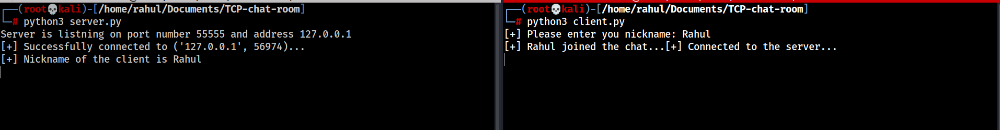

# TCP Chat Room

### 📝 About project
This is a command line chat room, which is based on *Transmission Control Protocol (TCP)*. Here multiple users can connect and chat with each other, and since it follows TCP there will be no loss of data.

**💡 What is TCP?**\
The *Transmission Control Protocol (TCP)* is one of the main protocols of the Internet protocol suite. TCP is a connection-oriented, and a connection between client and server is established before data can be sent. The server must be listening (passive open) for connection requests from clients before the connection is established. The main highlighting fetaure of TCP is that is perform Three-way handshake, and only after that we can send messages.

### 🗂 Libraries used
1. **Threading:** A thread is a single sequential flow of control within a program. The real excitement surrounding threads is not about a single sequential thread. Rather, it's about the use of multiple threads running at the same time and performing different tasks in a single program.\
We need to run multiple users at a single time, so for that threading module is used.
2. **Socket:** The Python interface is a straightforward transliteration of the Unix system call and library interface for sockets to Python’s object-oriented style: the socket() function returns a socket object whose methods implement the various socket system calls. Parameter types are somewhat higher-level than in the C interface: as with read() and write() operations on Python files, buffer allocation on receive operations is automatic, and buffer length is implicit on send operations.

### 🧱 How to use
1. First you have to clone/download this repository, you can do that by executing this command in terminal.
    ```shell
    git clone https://github.com/rahulMishra05/TCP-chat-room.git
    ```
2. Than change the working directory, and go to project directory.
    ```shell
    cd TCP-chat-room
    ```
3. Now if you use `ls` command you will all the files present in this directory. Among them file named `server.py` is the server file and `client.py` is the client file.
4. To use it first execute the server file like this.
    ```shell
    python3 server.py
    ```
5. After executing serevr file you will see a message like this in the terminal.
    ```shell
    Server is listning on port number 55555 and address 127.0.0.1
    ```
5. Now execute the client file. 
    ```shell
    python3 client.py
    ``` 
6. After executing the client file you will be asked to enter your nickname/name, and a message like this will appear.
    ```shell
    [+] Please enter you nickname: 
    ```
    After that you will see some messages like this 
    
7. Connect with multiple users, by exetuing `client.py` in multiple terminal and start chating.
